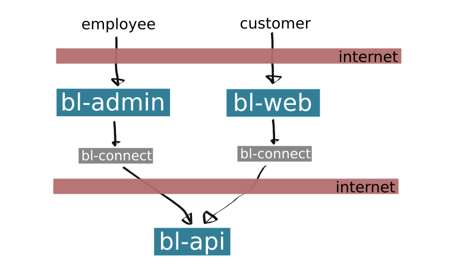

# Boklisten

## Our applications and modules

- Applications
  - [bl-api](bl-api/summary.md)
  - [bl-web](bl-web/summary.md)
  - [bl-admin](bl-web/summary.md)
- Modules
  - [bl-model](bl-model/summary.md)
  - [bl-login](bl-login/summary.md)
  - [bl-connect](bl-connect/summary.md)
  - [bl-post-office](bl-post-office/summary.md)
  - [bl-email](bl-email/summary.md)

# Introduction

At boklisten we sell, loan and rent out books. Customers comes to us either by
visiting our [website](https://boklisten.no) or by going to our multiple pop-up stands. Boklisten can be
translated to "the book list". We pride ourself by claiming to "Always have the
right book".

Our customers are people at school that need books to their classes.

To do this we have buildt a system from the ground up. This ensures that we
have full controll over the codebase, and can create specialized tools for our
business processes.

We have three main applications: `bl-api`, `bl-web` and `bl-admin`. They are
all equally important to the daily work at boklisten.

- `bl-api` is a backend service that controls the database and is used as a broker
  between `bl-web` and `bl-admin`.

- `bl-web` is the frontend application the customers uses. Here the customer can
  either rent, buy or loan items. They can also use it to view information
  provided to each branch and to extend a deadline.

- `bl-admin` is the frontend application for employees. Here the employee can
  view status of a item, rent, sell and buy items and take out reports.

## How our main applications connect to each other

## Other services

We have also created a number of other modules that are used by serveral of our
main applications.

- [bl-login](bl-login/summary.md)
  - For login and registration of a user. Used in `bl-web` and `bl-admin`.
- [bl-model](bl-model/summary.md)
  - All classes and interfaces that are shared between the main applications. Used by all applications and modules.
- [bl-connect](bl-connect/summary.md)
  - A module that is used to connect from frontend to `bl-api`. Used in `bl-web` and `bl-api`.
- [bl-post-office](bl-post-office/summary.md)
  - A module that handles Email and SMS. Used in `bl-api`.
- [bl-email](bl-email/summary.md)
  - A module that handles receipt email. Used in `bl-api`.
