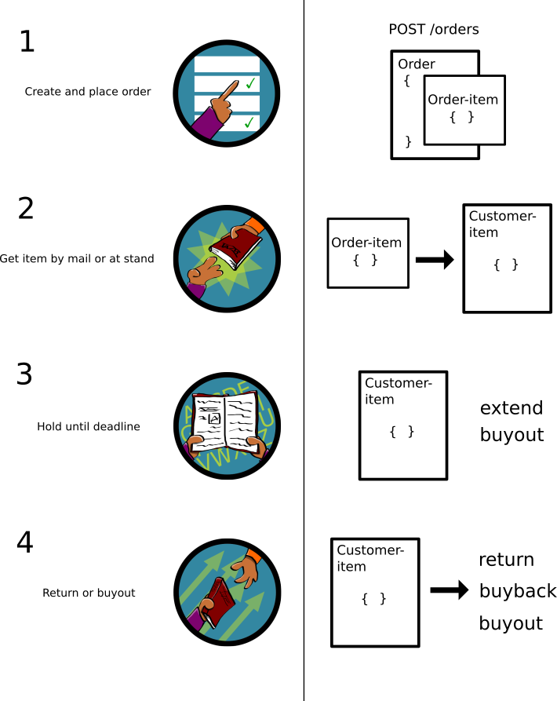

[\< bl-api](./summary.md)

# Orders
Orders are a key part of `bl-api`. It is the functionality that is most used
and are the main reason for `bl-api` to exist.

Think of orders as a list of actions done to a item. From the first placement
to the return. Every action (`extend`, `return`, `buyout` etc.) for a
[customer-item](./customer-items.md) is done through a new order.

* [Order and Customer-item flow](#order-and-customer-item-flow)
  * [Create and place order](#1-create-and-place-order)
  * [Get item by mail or at stand](#2-get-item-by-mail-or-at-stand)
  * [Hold until deadline](#3-hold-until-deadline)
  * [Return or buyout](#4-return-or-buyout)
* [Order anatomy](#order-anatomy)
* [Order-item types](#order-item-types)


# Order and Customer-item flow



### 1. Create and place order
The first thing that happens in a orders life is creation. Here everything is
defined, from order-item type to delivery method an payment options. The
creation and placing of order can be done by either a customer or a employee. 

* Create order
  * `HTTP POST /orders { order object }`
  * after the order is posted it goes through a validation process. Some key points: 
    * checks if the amounts add up
    * checks if the items are actually available 
    * checks if the user can do the operation.
    * checks if the object posted is a valid order
* Updating order
  * `HTTP PATCH /orders/:id { patch object }`
  * The order can be updated several times before placing it. This can be to:
    * edit delivery option
    * add payment
* Placing order
  * For customers: `HTTP PATCH /orders/:id/confirm`
  * For employees: `HTTP PATCH /orders/:id/place`
  * when placing the order a new validation process begins:
    * validates the order
    * validates the payments
    * validates the delivery
  * after validation:
    * add `customer-items` (if order-items describes this, and the user is `employee` or higher)
    * send email confirmation
    * update order with `{placed: true}`

### 2. Get item by mail or at stand 
When the customer is ready to get the item, the order-item is converted to a
[customer-item](./customer-items.md).

* Generate Customer-items
  * This happens on server side.
  * All order-items that have the type of `rent`, `partly-payment` or `loan` is converted to customer-items.
* Update order
  * The order is updated with the IDs of the newly generated customer-items
* Handout   
  * The item is then physically either given by hand or deliverd by mail to the customer.

[Read more about Customer-items](./customer-items.md)

### 3. Hold until deadline
The customer now holds the customer-item. She can hold on to the item until the deadline.

* Can do several actions before deadline
  * She can extend the deadline
    * This is done by creating a new order with order-item type `extend` for the corresponding customer-item
  * She can buyout the item
    * This is done by creating a new order with order-item type `buyout` for the corresponding customer-item

[Read more about Customer-items](./customer-items.md)

### 4. Return or buyout
When the deadline arrives the customer-item needs to be returned or bought out.

* Can return customer-item 
  * this is done by an employee
  * this is done by creating a new order with order-item type `return`
* Can buyout customer-item
  * this can be done by either employee or the customer
* The employee can buyback the item
  * only for customer-item type `partly-payment`
  * instead of paying the rest of the partly-payment, the customer can return it.


# Order anatomy
The order is simply a object holding information about what items the customer
wants to get/update, what payment should be used and what delivery method. 

### Simplified order
Underneat you can see a simplified order. It includes the amount and the type
of order-item. To read more about the order object you must visit the
`bl-model` repo.

```json
{
  "id": "order1",
  "amount": 220,
  "delivery": "delivery1",
  "payments": [
    "payment1", 
    "payment2"
  ],
  "orderItems": [
    {
      "title": "Catch-22",
      "type": "rent",
      "item": "item1",
      "info": {
        "deadline": "2020-01-01T00:00.000Z"
      },
      "amount": 100
    }, 
    {
      "title": "Animal farm",
      "type": "buy",
      "item": "item2",
      "amount": 120
    }
  ],
}
```
As you can see, a order is concisting of some key fields. The `amount` is the
total of all order-item amounts. `delivery` is a id of the delivery object.
`payments` is a list of ids to payment objects, it can be one, multiple or
none.

The `order-items` are a list of actions to be done to either a item or
customer-item. Here the `type` directs what to do with it. `amount` is what the
order-item type costs.

# Order item types
Each order consists of one or more order-items. These order-items each has a
type. The type is the action that should be done to that item or customer-item. 

## List of order-item types
Under is a list of order-item types, what they mean and for what type of item they are available for.

| order-item type | Description | Item | Customer-item | Order-item 
| ---- | ---- | ---- | ---- | ---- |
| rent | rent item to a set deadline  | x |  |  |
| buy | buy the item | x |  |  | 
| loan | loan item to a certain deadline | x |  |  |
| partly-payment | buy the item but with one payment now and one later at a set deadline | x |  |  |
| sell | sell the item to the company | x |  |  |
| buyout | buyout a customer-item of type `loan` or `rent` instead of returning it | | x |  |
| extend | extend a customer-item's deadline to a later deadline | | x |  |
| return | return a customer-item whoes type was either `loan` or `rent` | | x |  |
| buyback |  if the customer-item is of type `partly-payment`, instead of paying second payment he can delivery it back to the company | | x |  |
| cancel | cancelation of a order-item, or a customer-item with handout date less than two weeks | | x | x |
 

## Order-item type permission 
Not all order-item types are available for everyone. A customer shall not be
allowed to return a customer-item for example.

| order-item type | customer | employee | manager | admin | super |
| ---- | ---- | ---- | ---- | ---- | ---- |
| rent | x | x | x | x | x |
| buy | x | x | x | x | x |
| loan | x | x | x | x | x |
| partly-payment | x | x | x | x | x |
| buyout | x | x | x | x | x |
| extend | x | x | x | x | x |
| sell |  | x | x | x | x |
| return |  | x | x | x | x |
| buyback |  | x | x | x | x |
| cancel |  | |  | x | x |


