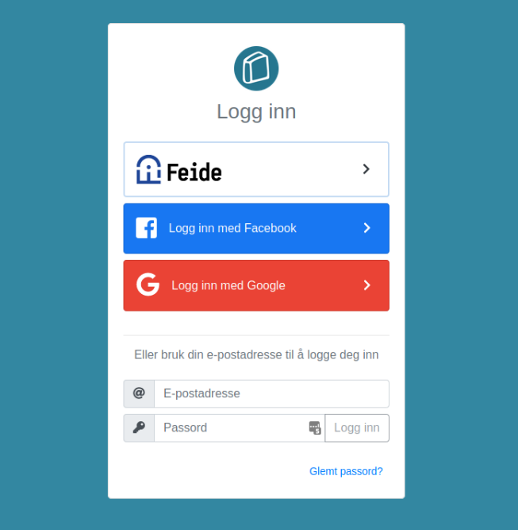
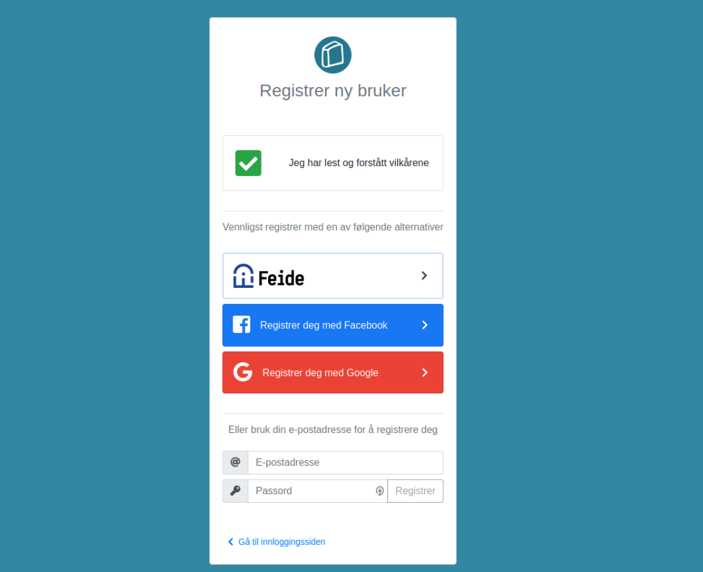

# bl-login
`bl-login` is a login and registration module used by `bl-web` and `bl-admin`.

* [Login](#login)
  * [Login with third-party](#login-with-third-party)
  * [Login with username and password](#login-with-username-and-password)
* [Registration](#registration)
  * [Accept terms](#accept-terms)
  * [Register with third-party](#login-with-third-party)
  * [Register with username and password](#register-with-username-and-password)
* [User detail edit](#user-detail-edit)
* [Forgot password](#forgot-password)

# Login

The core part of `bl-login` module is login. Under `/auth/login` you will see the sceen underneath.

## Four login options

There are currently four possible login options.
* Third-party providers
  * Feide
  * Facebook
  * Google
* Local
  * Username and password

## Login with third-party
If user click on one of the third-party providers she will be taken to their website for login.

#### If login failed
  * Will be redirected to `/auth/social/failure`
  * User gets a message of 'please try again'

## Login with username and password
User can also login with username and password.

* `username`: a valid email
* `password`: a string at least 6 characters long

#### If login failed
* Will be redirected to `/auth/login` with message about 'try agian'.  

## If login was successful
* `bl-api` will redirect to url `/auth/token;accessToken=at;refreshToken=bt;`.
* The accessToken and refreshToken will be stored in the web-browser.
* If `bl-redirect` is set the user will be redirected to that page 

## Further information
For documentation about how login works in bl-api [please visit bl-api's documentation](../bl-api/authorization.md#login-and-register)

# Registration
Another core part of `bl-login` is registration. Under `/auth/register` you
will see the screen underneath.

## Accept terms
To even be able to register the user must accept the terms. By clicking the
'please accept our terms'-button a modal with the terms will appear. Once
'confirmed' the register-options will be displayed.

## Register with third party
Three options:
* Feide
* Facebook
* Google

Registration for third parties is actually completly the same as login.
Please read the part about [third-party login](#login-with-third-party).

## Register with username and password

## Further information
For documentation about how register works in bl-api [please visit bl-api's documentation](../bl-api/authorization.md#login-and-register)

# User detail edit
# Forgot password

## Authorization
To read more about how authorization is implemented on the server side,
[please read the documentation on bl-api's authorization](../bl-api/authorization.md)
